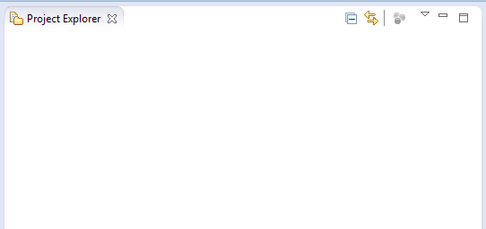
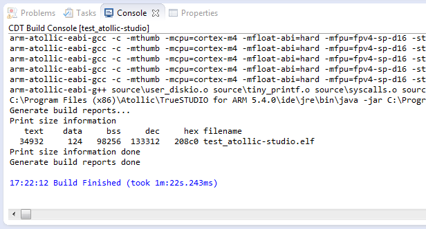

# How to use IDE

You can download the IDE here: http://timor.atollic.com/truestudio/

## Add our existing project to the IDE

After you clone our repository, launch Atollic TrueSTUDIO.
Select the workspace as the directory of the cloned repository.

After launch we can see there is no project yet.

To add existing project, Go to `File->Import`

In the prompt window. Select `General->Existing Projects into Workspace`

Select one of our existing project, for example, `projects/test_atollic-studio`.

Then you can see a project is added.

Try compiling by clicking `Build Project` after you right click the project.

After compiling you should see the success message like this.

Then try to program this to your board by clicking `Debug As -> 1`

Now you should be able to debug just like other IDE. In the example project, the LED of the board should be blinking!

## How to created a new project in the IDE

Now it is time to make a simple blinking LED project.

Go to `File -> New -> C++ Project`

Type a project name and set a location, if you want to make a project in a specific location like the example, uncheck `Use default location`

Set a hardware configuration as exactly the same above.

For the software configuration, just leave it as it is (meaning not important)

Set a debugger configuration as ST-LINK. ST-LINK is our debugger using. Then click `Finish`

You could see there is auto-generated files in the project. We need to delete them.

Go to the project folder and delete `Drivers` and `src` folder.

Then `clean project` first and go to `Properties`.

In the properties, go to `C/C++ General -> Paths and Symbols`. Then in the ` Includes ` tab delete all Include directories in all languages.

Go to `Source Location` Folder, and then click `Link folder` and the above graphic will be shown.

Select `source` folder in the top directory in our repository.

Go to `Includes` tab. Let import our pre-made settings.

Click `Import Settings`...

Select `path-and-symbols.xml` in `settings` folder.

You should see the Includes and Symbols are updated.

also, for main.cpp there is example main file in `settings` folder.

copy and past to the project folder. Then build it and debug!